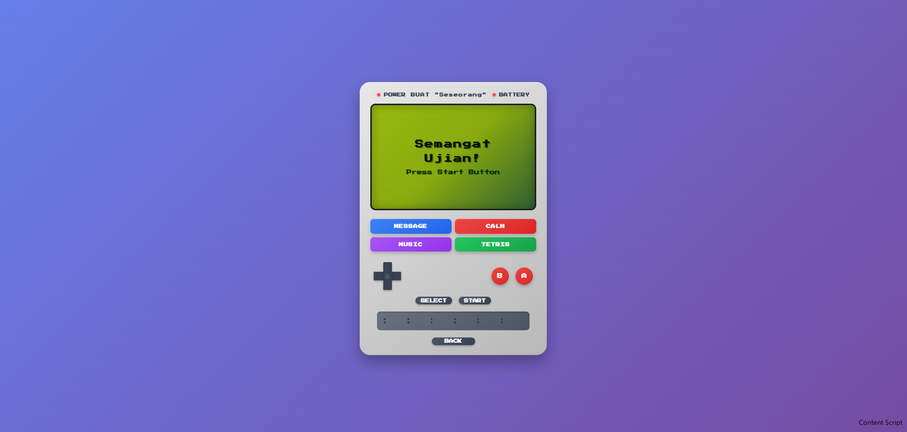

# 🎮 GameBoy Retro Web


**GameBoy Retro** adalah sebuah proyek web eksperimental yang menghadirkan nostalgia antarmuka konsol klasik GameBoy ke dalam browser modern. Proyek ini menggabungkan desain retro pixel-art dengan teknologi web terkini.


*(Catatan: Ganti path gambar di atas dengan screenshot asli proyek Anda)*

## ✨ Fitur Utama

* **Retro UI Design:** Antarmuka yang meniru fisik GameBoy klasik dengan detail CSS.
* **Responsive Layout:** Tampilan yang menyesuaikan ukuran layar (Desktop & Mobile).
* **Interactive Controls:** Tombol D-Pad, A, B, Start, dan Select yang dapat diklik/interaktif.
* **Classic Color Palette:** Menggunakan skema warna hijau monokrom khas layar dot-matrix jadul.

## 🛠️ Tech Stack

Proyek ini dibangun menggunakan teknologi berikut:

*  **HTML5** - Struktur semantik aplikasi.
*  **CSS3** - Styling untuk efek retro, pixel art, dan animasi.
*  **TypeScript** - Pengetikan statis untuk kode yang lebih aman dan terstruktur.

## 🚀 Cara Menjalankan (Local)

Ikuti langkah ini untuk menjalankan proyek di komputer Anda:

1.  **Clone repository**
    ```bash
    git clone [https://github.com/Raiiynn/gameboy-retro.git](https://github.com/Raiiynn/gameboy-retro.git)
    ```
2.  **Masuk ke direktori**
    ```bash
    cd gameboy-retro
    ```
3.  **Install Dependencies** (Karena pakai TypeScript, biasanya perlu install modul)
    ```bash
    npm install
    ```
4.  **Jalankan Project**
    ```bash
    npm run dev
    ```